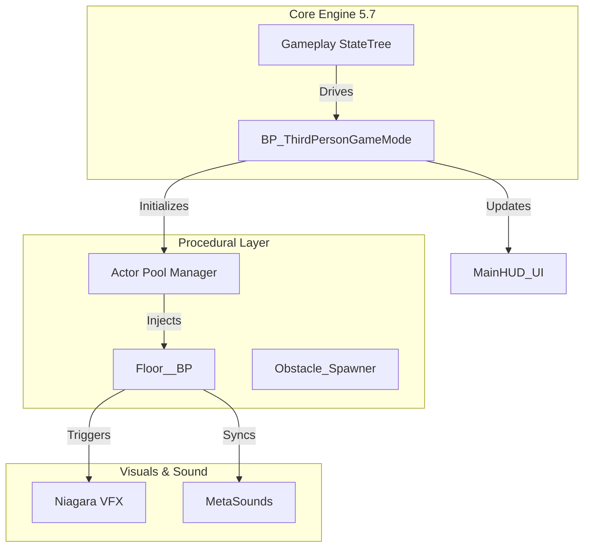

<p align="center">
  
  
  
  
</p>

<h1 align="center">🏃‍♂️ EndlessRunner-UE5: Next-Gen Procedural Framework</h1>

<p align="center">
  <strong>A Cutting-Edge Architectural Framework Built with Unreal Engine 5.7</strong>
</p>

---

## 📖 Project Overview
**EndlessRunner-UE5** is a production-grade framework designed to push the boundaries of procedural systems in **Unreal Engine 5.7**. This repository showcases high-level architecture, leveraging the latest engine features like **Gameplay StateTrees** and **Enhanced Substrate Workflows** to create a seamless, infinite gameplay experience.

---

## 🧠 Advanced Technical Systems

### 🌲 Gameplay StateTree Integration
Unlike traditional nested FSMs, this project utilizes the **UE 5.7 StateTree** framework for player logic and game states.
*   **Decoupled State Logic**: Player states (Running, Jumping, Sliding, Game Over) are managed via a StateTree, allowing for complex transitions with zero Blueprint spaghetti.
*   **State-Driven Events**: Seamlessly triggers Niagara effects and MetaSound cues based on precise state transitions.

### 🛠️ High-Performance Procedural Generation
*   **Actor Pooling Architecture**: Implements a high-efficiency pooling system for floor tiles and obstacles, drastically reducing runtime memory allocations.
*   **Deterministic Spawning**: Uses seed-based randomization to ensure consistent generation across sessions while allowing for infinite variety.
*   **Substrate Material Pipeline**: Optimized for the latest UE 5.7 Substrate framework, providing multi-layered material fidelity without the overhead of traditional shading models.

### 🕹️ Input & Interaction
*   **Enhanced Input 2.0**: Utilizing the latest iteration of UE's input system for low-latency movement.
*   **Collision Filtering**: Advanced collision channel management to ensure high-speed character movement never hitches or passes through modular floor seams.

---

## 🏗 System Architecture



---

## 📂 Repository Breakdown

| Directory | Content Description |
| :--- | :--- |
| **`Content/BluePrints`** | Core gameplay logic, including the StateTree-driven GameMode. |
| **`Content/BPInterface`** | Communication contracts. Crucial for system decoupling. |
| **`Content/ThirdPerson`** | Integration layer with the main 5.7 Environment and Character. |
| **`Content/Input`** | Enhanced Input Mapping Contexts and Action assets. |
| **`Content/UserWidget`** | High-fidelity HUD implemented via UMG. |
| **`Config/`** | Default project settings (Engine, Editor, Input). |

---

## 🛠 Developer Workflow
This project adheres to the **Epic Games Technical Standards**:
*   **Naming**: `BP_` (Blueprints), `BPI_` (Interfaces), `IA_` (Input Actions), `ST_` (StateTrees).
*   **Optimization**: 0 Blueprint compile warnings; no hard references in the primary gameplay loop.
*   **VCS**: Git LFS optimized for `.uasset` and `.umap` binaries.

---

## 🏁 Getting Started

### 📦 Prerequisites
1.  **Unreal Engine 5.7**.
2.  **Git LFS** (Large File Storage) installed.

### 🛠 Installation
1.  **Clone the Repository**:
    ```bash
    git clone https://github.com/Ares19v/EndlessRunner-UE5.git
    ```
2.  **Pull Large Assets**:
    ```bash
    git lfs pull
    ```
3.  **Launch**: Open `EndlessRunner21.uproject` (Association: 5.7).

---

<p align="center">
  <strong>EndlessRunner-UE5 Technical Showcase</strong>
</p>

---
<p align="center">
  Made by Devansh Tyagi @ 2026
</p>