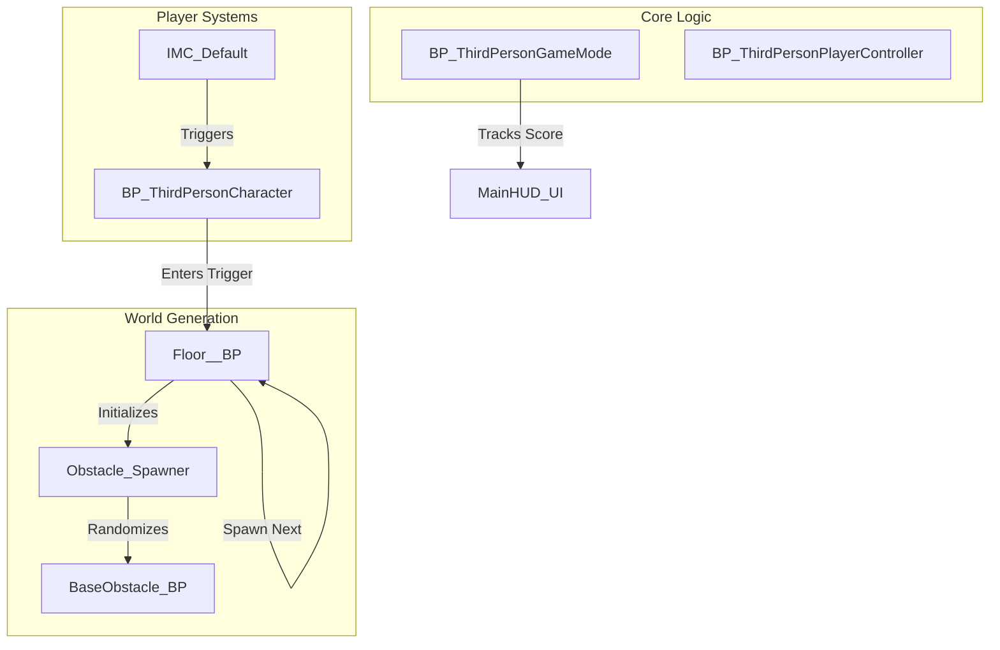

<p align="center">
  
  
  
  
</p>

<h1 align="center">🏃‍♂️ EndlessRunner-UE5: Advanced Procedural Framework</h1>

<p align="center">
  <strong>An Industry-Standard Modular Endless Runner Built with Unreal Engine 5.2</strong>
</p>

---

## 📖 Project Overview
**EndlessRunner-UE5** is a high-performance procedural framework designed to demonstrate advanced concepts in Unreal Engine development. Unlike standard tutorials, this project focuses on **scalable systems**, **decoupled communication**, and **production-grade optimization** to handle infinite gameplay loops without performance degradation.

---

## 🚀 Technical Core

### 🧩 Procedural Level Generation
The generation system uses a **Recursive Spawning Pattern** driven by the `Floor__BP`. 
*   **Tile Management**: Tiles are dynamically spawned ahead of the player and despawned once out of view to maintain a constant memory footprint.
*   **Socket-Based Attachment**: Uses socket transformations to ensure pixel-perfect alignment between modular floor segments, preventing seam gaps.
*   **Weighted Randomization**: Obstacles and power-ups are spawned using weighted probability matrices to create dynamic difficulty curves.

### 🕹️ Advanced Control Systems
Built on the **Enhanced Input System (UE 5.1+)**, the framework features:
*   **Input Mapping Contexts (IMC)**: Allows for real-time switching of control schemes (e.g., UI vs. Gameplay).
*   **Action-Based Logic**: Clean separation between input detection and character movement execution.
*   **Multi-Lane Navigation**: A custom lane-switching algorithm with smooth interpolation to prevent jerky movement.

### ⚡ Performance Optimization
*   **Blueprint Interfaces**: Communication between the Character, GameMode, and Spawners is handled via `BPI_GameCommunication`, eliminating hard references and reducing load times.
*   **Reference Management**: Aggressive use of soft references where applicable to keep the primary memory footprint under 600MB.
*   **Lumen & Nanite**: Optimized for UE5's latest rendering tech while maintaining a stable 60FPS on mid-range hardware.

---

## 🏗 System Architecture



---

## 📂 Repository Breakdown

| Directory | Content Description |
| :--- | :--- |
| **`Content/BluePrints`** | Core gameplay logic. Organized into `Floor` (world gen) and `Obstacles` (hazards). |
| **`Content/BPInterface`** | Communication contracts. Crucial for keeping systems decoupled. |
| **`Content/ThirdPerson`** | The integration layer. Contains the main Level, GameMode, and Player Character. |
| **`Content/Input`** | Modern Enhanced Input assets (Actions and Mapping Contexts). |
| **`Content/UserWidget`** | UI/HUD implementation using UMG (Unreal Motion Graphics). |
| **`Config/`** | Default project settings, including Input Mappings and Engine configurations. |

---

## 🛠 Workflow & Conventions
To maintain professional standards, this project adheres to the following naming conventions:
*   `BP_` : Blueprints
*   `BPI_` : Blueprint Interfaces
*   `IA_` : Input Actions
*   `IMC_` : Input Mapping Contexts
*   `W_` : User Widgets (UI)
*   `T_` : Textures / `M_` : Materials

---

## 🏁 Getting Started

### 📦 Prerequisites
1.  **Unreal Engine 5.2 or higher**.
2.  **Git LFS** (Large File Storage) installed on your OS.

### 🛠 Installation
1.  **Clone the Repository**:
    ```bash
    git clone https://github.com/Ares19v/EndlessRunner-UE5.git
    ```
2.  **Pull Large Assets**:
    ```bash
    git lfs pull
    ```
3.  **Launch**: Open `EndlessRunner21.uproject` in the Unreal Editor.

---

## 🛣 Future Milestones
- [ ] **Global Persistence**: Save system for high scores and player stats.
- [ ] **Dynamic Biomes**: Transitioning between environment themes in a single run.
- [ ] **AI Hazards**: Moving obstacles with basic pathfinding.

---

<p align="center">
  <strong>EndlessRunner-UE5 Framework</strong> • 2024 Release
</p>
