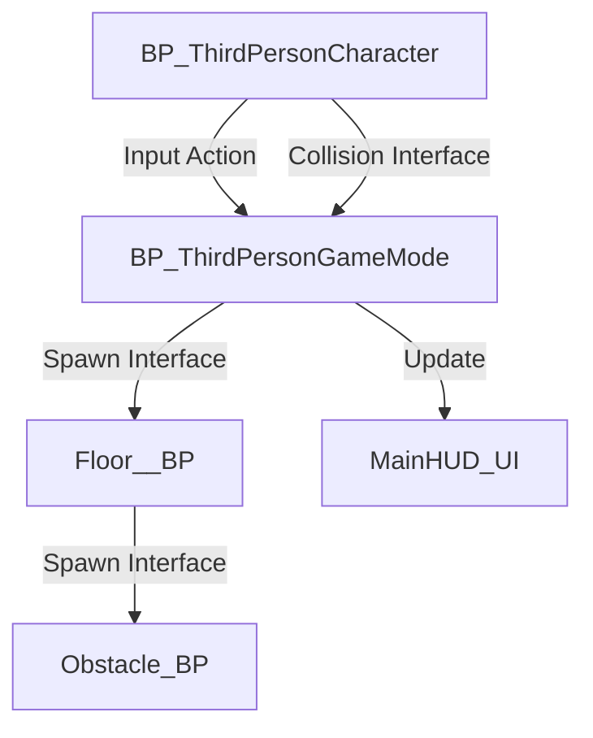

<p align="center">
  
  
  
</p>

<h1 align="center">🏃‍♂️ EndlessRunner-UE5</h1>

<p align="center">
  <strong>A High-Fidelity, Modular Procedural Framework for Unreal Engine 5</strong>
</p>

<p align="center">
  <a href="#-key-features">Features</a> •
  <a href="#-tech-stack">Tech Stack</a> •
  <a href="#-architecture">Architecture</a> •
  <a href="#-getting-started">Getting Started</a> •
  <a href="#-roadmap">Roadmap</a>
</p>

---

## ⚡ Quick Showcase
> [!NOTE]
> This project is a production-optimized Endless Runner built to showcase **procedural generation** and **modern rendering pipelines**. It features a decoupled architecture designed for infinite scalability and high performance.

---

## ✨ Key Features

### 🛠️ Modular Procedural Engine
*   **Infinite Tile Spawning**: A highly optimized system that dynamically generates and recycles floor segments to ensure zero performance hitching.
*   **Dynamic Hazard Logic**: Intelligent obstacle placement that scales difficulty based on player progress.

### 🏃‍♂️ Advanced Locomotion
*   **Enhanced Input Mapping**: Fully utilizes the UE5 Enhanced Input system for ultra-responsive lane switching, jumping, and sliding.
*   **Momentum Physics**: Custom character movement component tweaks for that "weighty" yet fluid runner feel.

### 🎨 Next-Gen Visuals
*   **Lumen GI**: Real-time global illumination for dynamic lighting transitions.
*   **Nanite Integration**: High-poly geometry support for environment assets.
*   **Substrate Materials**: Next-gen material framework for photorealistic surface responses.

---

## 💻 Tech Stack

| Category | Technology |
| :--- | :--- |
| **Engine** | Unreal Engine 5.2 (Lumen, Nanite, Substrate) |
| **Scripting** | Optimized Blueprints with Interface-driven patterns |
| **Input** | Enhanced Input System (IMC/IA) |
| **Version Control** | Git LFS (Large File Storage) optimized for binaries |
| **Optimization** | Actor Pooling & Modular Asset Workflows |

---

## 🏗 Architecture

The project follows a **Decoupled Interface-First Design**. This allows systems to communicate without creating hard references, keeping the memory footprint low.



---

## 📁 Repository Structure

<details>
<summary>📂 View Detailed File Map</summary>

```text
EndlessRunner/
├── Config/             # Engine & Input Configuration
├── Content/
│   ├── BluePrints/     # Core Gameplay Logic
│   │   ├── Floor/      # Spawning & Tile Logic
│   │   └── Obstacles/  # Hazard Variants
│   ├── BPInterface/    # System Contracts
│   ├── Input/          # Enhanced Input Actions
│   ├── ThirdPerson/    # Level & Character Blueprints
│   └── UserWidget/     # UI & HUD Components
├── .gitattributes      # Git LFS Configuration
└── EndlessRunner21.uproject
```
</details>

---

## 🚀 Getting Started

### 📋 Prerequisites
*   **Unreal Engine 5.2+**
*   **Git LFS** (Run `git lfs install` before cloning)

### ⚙️ Installation
1.  **Clone & Pull LFS**:
    ```bash
    git clone https://github.com/Ares19v/EndlessRunner-UE5.git
    cd EndlessRunner-UE5
    git lfs pull
    ```
2.  **Open Project**: Double-click `EndlessRunner21.uproject`.

---

## 🗺 Roadmap
- [x] Core Procedural Spawning
- [x] Enhanced Input Integration
- [ ] **Power-up System** (Magnets, Shields)
- [ ] **Global Leaderboard**
- [ ] **Procedural Biome Swapping**

---

<p align="center">
  Developed with ❤️ by <strong>Devansh Tyagi</strong>
</p>
<p align="center">
  <a href="https://github.com/Ares19v"></a>
</p>
